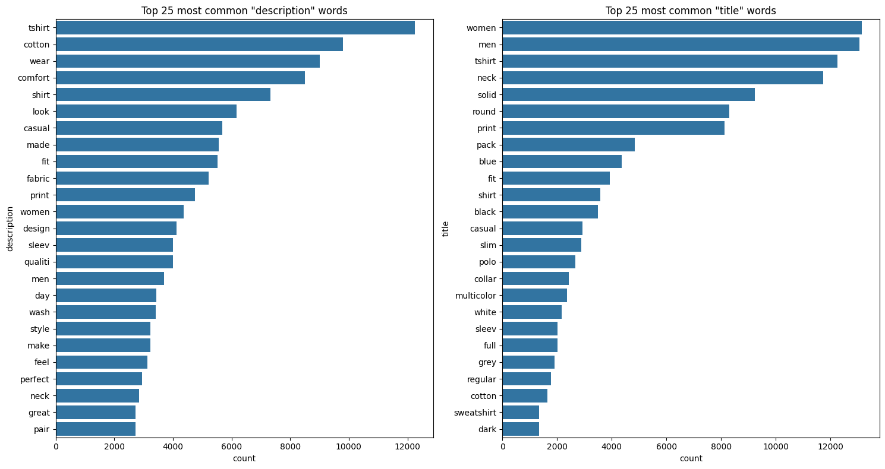
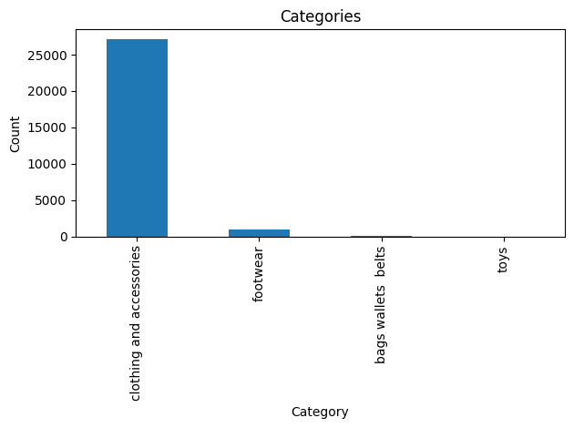
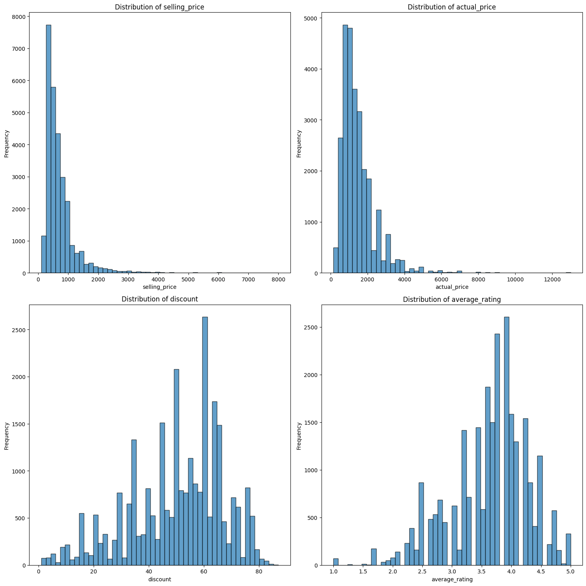
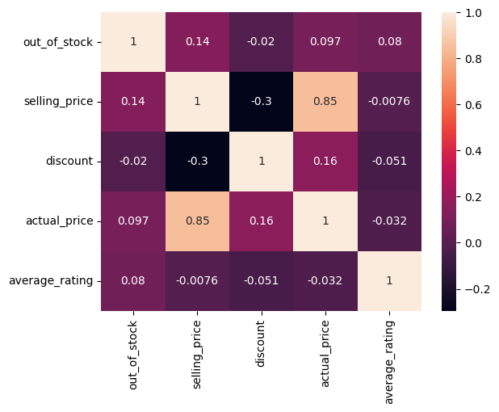
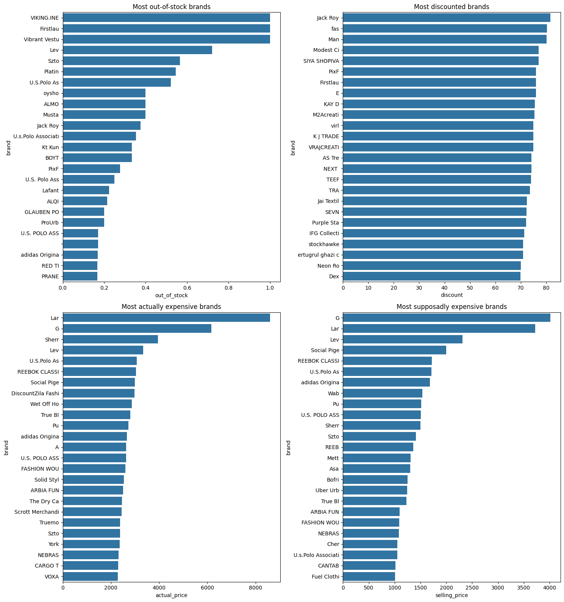

# IRWA Final Project – Part 1  
### Group 23  
- Luca Franceschi  
- Pau Peirats  
- Júlia Othats-Dalès 

## 1. Data Preparation

### 1.1 Text Pre-processing  

Before performing any analysis on the dataset, we have to clean and standardize the text fields **title** and **description** — to prepare them for indexing and retrieval.  

The following preprocessing pipeline was implemented using **NLTK**:

1. **Lowercasing** – Converting everything to lowercase ensures that words sometimes capitalized sometimes not are treated as the same word. 
2. **Removing punctuation** – Punctuation marks do not add meaning for most text analysis tasks. Removing them simplifies the data and avoids unnecessary tokens.
3. **Normalization** - This step converts accented or special characters  
4. **Tokenization** – splits text into individual tokens using `word_tokenize()`. This is a key step before removing stopwords and applying stemming. 
5. **Stopword removal** – Stopwords (like “and”, “the”, “of”) are very common words that usually don’t help in understanding the meaning or distinguishing documents. Removing them reduces noise.
6. **Filtering out non-alphabetic tokens** - We removed tokens that contain numbers or symbols, keeping only words made of letters.
7. **Stemming** - We reduced each word to its root form to group similar words tog
8. **Noise reduction** - Words with very few letters (like “a”, “an”, “is”) often have little meaning, so we removed tokens shorter than 3 characters.

Example output fields added to the dataset:
- `title_clean`
- `description_clean`

| pid | title | title_clean |
|-----|--------|--------------|
| TKPFCZ9EA7H5FYZH | Solid Women Multicolor Track Pants | solid women multicolor track pant |

These cleaned fields will serve as the **textual representation** of each product in future search and retrieval steps.

### 1.2 Dataset Schema for Future Queries 

After cleaning the text fields, the next step is to make sure our dataset includes only the columns that will be useful for the final queries.  
The project requires that, for each selected document, the output should contain the following fields when they are available:

- `pid`
- `title`
- `description`
- `brand`
- `category`
- `sub_category`
- `product_details`
- `seller`
- `out_of_stock`
- `selling_price`
- `discount`
- `actual_price`
- `average_rating`
- `url`

All documents in the corpus are now represented using this schema.  
The `pid` field is preserved as a unique identifier for evaluation purposes (as required by the validation labels).

### 1.3 Handling of Metadata Fields

#### Alternatives Considered 

#### **Option 1 – Merge into a single text field**
In this option, we would have only one text field with all the metadata, allowing for flexible queries but we lose distinction (brand is not the same thing as category or seller)

#### **Option 2 – Index as separate fields (Chosen approach)**
In this second option, we treat each as its own field, where each can be preprocessed by lowercasing, removing punctuation, and tokenizing. This way we mantain control for ranking and weighting, don't confuse different concepts and we can make column-specific queries. It can increase the size of the index, and making it a little more complex but it is the best choice for our case because each field has distinct meaning that we want to keep separate and also rank separately.

#### **Option 3 – Hybrid approach**
We also considered a hybrid approach where we keep separate fields AND create a combined metadata field for general text searches but this option is redundant. 

#### Other Considerations for metadata Fields
After choosing to keep separate the fields, we still have to decide how we treat them. Besides the text fields (`title` and `description`), the dataset includes several metadata fields that may also be useful for retrieval:
- `category`
- `sub_category`
- `brand`
- `product_details`
- `seller`
We decided to clean `category`, `sub-category` and `product_details` by lowercasing and removing punctuation since they have general descriptions. In the other hand, the `brand` and `seller` fields were kept as they were to preserve the proper nouns. The brands and sellers are identifyers, not descriptions, changing them could result in loss of meaning, and make retrieval less precise, since we could be looking for a specific brand and not find it due to normalization.  

### 1.4 Handling of Numerical and Binary Fields

These fields are not indexed as text but rather stored as numeric attributes to be used as ranking, sorting and filtering during retrieval. In our data processing we make sure to convert numeric fields to their appropriate types with `to_numeric` and binary fields like `out_of_stock` with `map`. Additionnaly, we had to remove '% off' from the `discount` field. 

## 2. Exploratory Data Analysis

We can see that most common words are related to clothing.

And that makes sense since most of the products are related to clothing.

Among all products, we can see that most of them cost actually more than what they are supposed to. Also, ratings seem to be a bit right-skewed (people rate the products good on average).

We can clearly see that the most correlated variables are *actual_price* and *selling_price*, which of course makes sense. We can also see that *discount* and *selling_price* are negatively correlated (about -30%), which also makes sense.

>! We need to fix brand namings since brands like "U.S. Polo Association" appears multiple times under different names like all caps, without characters, etc.